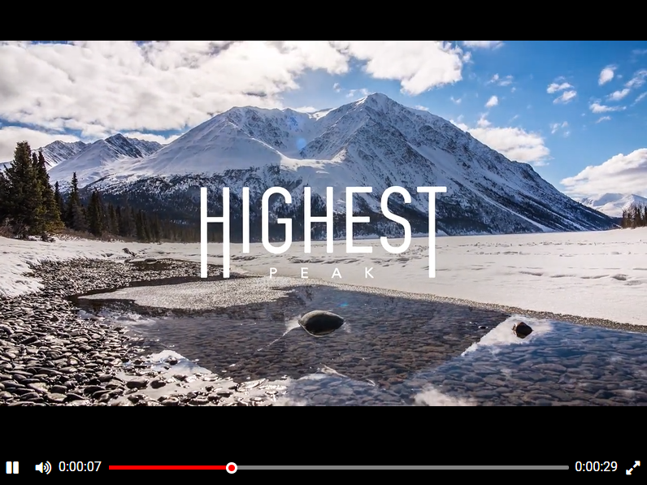

## Видеоплеер

Верстка для сайта с видеоплеером.

Пример работы:
[видеоплеер](https://pszhuchkov.github.io/player-layout/)

### Запуск сайта
Для локального запуска сайта достаточно
скачать файл `index.html` и папку со статическими файлами `static`,
после чего открыть файл `index.html` в браузере. 

